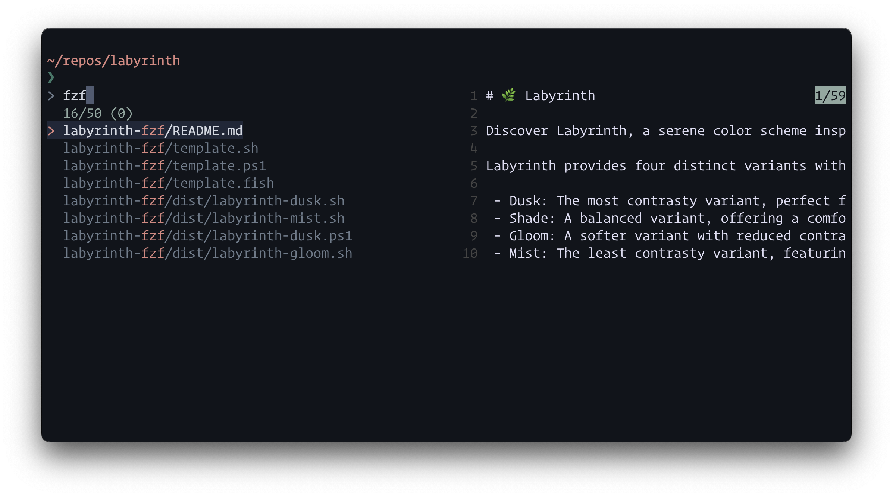
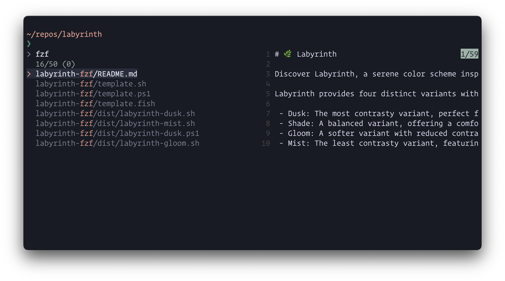
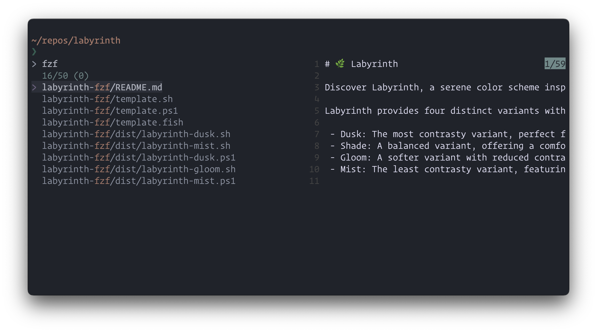

# 🌿 Labyrinth

Discover Labyrinth, a serene color scheme inspired by hidden pathways and mossy landscapes. Let its gentle tones guide your creativity with calm elegance.

Labyrinth provides four distinct variants with varying levels of contrast and color vibrancy to suit your preferences:

 - Dusk: The most contrasty variant, perfect for those who prefer sharp distinctions and vibrant colors.
 - Shade: A balanced variant, offering a comfortable middle ground with moderate contrast and vibrancy.
 - Gloom: A softer variant with reduced contrast, ideal for a more subdued and relaxed visual experience.
 - Mist: The least contrasty variant, featuring the most gentle and subtle tones for a calm and unobtrusive interface.

Whether you're coding, designing, or simply exploring new aesthetics, Labyrinth adapts to your needs with its harmonious palette.

## Usage

**Bash-like shells**

Copy the contents of `dist/*.sh` to `~/.profile` or similar.

**Fish**

Copy the contents of `dist/*.fish` to `~/.config/fish/config.fish` or create a
custom function:

```fish
# ~/.config/fish/functions/fzf.fish
function fzf --wraps="fzf"
    # Paste contents of preferred variant here

    command fzf
end
```

**PowerShell**

Copy the contents of `dist/.*ps1` to `~/Documents/PowerShell/Microsoft.PowerShell_profile.ps1`.

**Nix Home Manager**

```nix
let
  theme = pkgs.fetchFromGitHub {
    owner = "dgabka";
    repo = "labyrinth-fzf";
    rev = "9fe783b027f8c35c04b686ff4cb1a9777e5df73d";
    sha256 = "sha256-/HJ8XEHoqxfOHmqmCkIuU7KCBqlzsj7reTjo3Fo7UGk=";
  };
in {
  programs.fzf.colors = import "${theme}/dist/labyrinth-dusk.nix"
}
```

## Gallery

**Labyrinth Gloom**



**Labyrinth Dusk**



**Labyrinth Shade**


**Labyrinth Mist**



### Credits

Thanks to the [Rosé Pine](https://github.com/rose-pine) creators!
A special thanks to [Rosé Pine for fzf](https://github.com/rose-pine/fzf) which this theme is based on.
